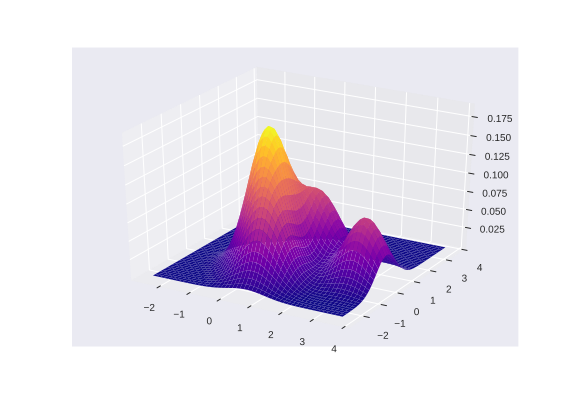

# ¿Qué es mlpack?

## 

* Machine learning swiss army knife
* Análogo a [scikit-learn](http://scikit-learn.org)
* Algoritmos a cascoporro
* Últimos algoritmos disponibles


<aside class="notes">
- 2007 Georgia Tech FASTLab arboles
- Cajas con algoritmos
- Filosofia últimos algoritmos + velocidad.
</aside>

## ¡Rápido! Pero... C++


<aside class="notes">
- No herencia
- Templates polimorfismo estático
- Llamar desde C++
</aside>

## [Armadillo](http://arma.sourceforge.net/)

* Calculadora de matrices (Álgebra lineal)
* Paralelización con [OpenMP](http://www.openmp.org/)
* [Apache License 2.0](https://opensource.org/licenses/Apache-2.0)

<aside class="notes">
- GPU con NVBLAS
- Trabajando en OpenCL (Bandicoot)
</aside>

***


## ¡Hay una serpiente en mi bota!

Bindings con Python!
```python
from mlpack import knn
import pandas as pd
import numpy as np

input = pd.read_csv('iris.csv')
output = knn(k=5, reference=input)
neighbors = output['neighbors']
```

<aside class="notes">
- Pandas y Numpy
- También R, Java (NO) y Go
</aside>

## In the Beginning... Was the Command Line

```shell
mlpack_knn -q query_dataset.csv -r reference_dataset.csv -k 5
```


<aside class="notes">
- Pipes (?)
</aside>

# ¿Y qué has hecho tu?

## Función de densidad

$f$ integrable de Lebesgue
$$ f \geq 0 $$
$$ P[a \leq X \leq b] = \int_{a}^{b}f(x)dx $$

## Ejemplo de $f(x)$ normal


## Funciones Kernel


<aside class="notes">
- Dos objetos se parecen
- Grande cuando se parecen, peque cuando no
</aside>

## [Kernel Density Estimation](https://en.wikipedia.org/wiki/Kernel_density_estimation)

> In probability and statistics, density estimation is the construction of an estimate, based on observed data, of an unobservable underlying probability density function. - Wikipedia

## Un ejemplo


***



***

* Complejidad $O(n^2)$
* Extremos "poco" relevantes

Solución [Tree-Independent Dual-Tree Algorithms](https://arxiv.org/abs/1304.4327)


<aside class="notes">
- Árboles para particionar el espacio
- KD-Tree Cover-Tree...
- 2 Árboles a la vez
</aside>
