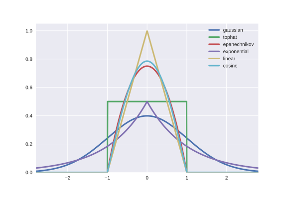
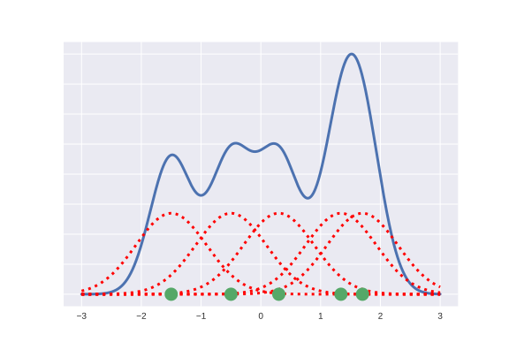

# ¿Qué es mlpack?

## 

* Machine learning swiss army knife
* Análogo a [scikit-learn](http://scikit-learn.org)
* Algoritmos a cascoporro
* Últimos algoritmos disponibles


## ¡Rápido! Pero... C++


## [Armadillo](http://arma.sourceforge.net/)

* Calculadora de matrices (Álgebra lineal)
* Paralelización con [OpenMP](http://www.openmp.org/)
* [Apache License 2.0](https://opensource.org/licenses/Apache-2.0)

## 


## ¡Hay una serpiente en mi bota!

Bindings con Python!
```python
from mlpack import knn
import pandas as pd
import numpy as np

input = pd.read_csv('iris.csv')
output = knn(k=5, reference=input)
neighbors = output['neighbors']
```

## In the Beginning... Was the Command Line

```shell
mlpack_knn -q query_dataset.csv -r reference_dataset.csv -k 5
```


# ¿Y qué has hecho tu?

## Función de densidad

$f$ integrable de Lebesgue
$$ f \geq 0 $$
$$ P[a \leq X \leq b] = \int_{a}^{b}f(x)dx $$

## Ejemplo de $f(x)$ normal


## Funciones Kernel



## [Kernel Density Estimation](https://en.wikipedia.org/wiki/Kernel_density_estimation)

> In probability and statistics, density estimation is the construction of an estimate, based on observed data, of an unobservable underlying probability density function. - Wikipedia

## Un ejemplo


